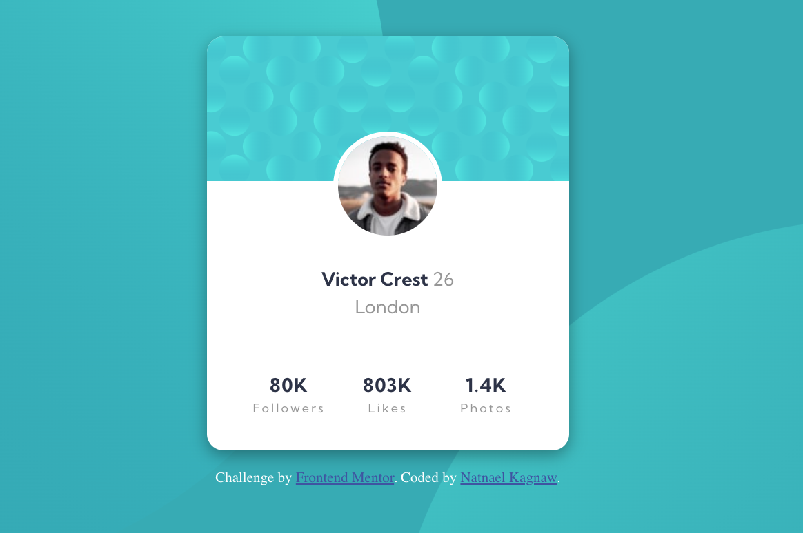

# Frontend Mentor - Profile card component solution

This is a solution to the [Profile card component challenge on Frontend Mentor](https://www.frontendmentor.io/challenges/profile-card-component-cfArpWshJ).

## Table of contents

- [Overview](#overview)
  - [The challenge](#the-challenge)
  - [Screenshot](#screenshot)
  - [Links](#links)
- [My process](#my-process)
  - [Built with](#built-with)
  - [What I learned](#what-i-learned)
  - [Continued development](#continued-development)
  - [Useful resources](#useful-resources)
- [Author](#author)
- [Acknowledgments](#acknowledgments)

## Overview

### The challenge

- Build out the project to the designs provided

### Screenshot



### Links

- Solution URL: [Github Link](https://github.com/NatnaelSisay/profile-card-component-main)
- Live Site URL: [Netlify Link](https://stately-torrone-84dade.netlify.app)

## My process

### Built with

- Semantic HTML5 markup
- CSS custom properties
- Flexbox
- CSS Grid
- Mobile-first workflow

### What I learned

I have learned how to use background-position property to place multiple background pictures in specific section of UI.

```css
body {
	background-image: url(../images/bg-pattern-top.svg),
		url(../images/bg-pattern-bottom.svg);
	background-position: top -80% left -50vw, bottom -300% right -50vw;
	background-size: 100%, 100%;
}
```

### Continued development

Even though i have seen how to use background position, the desktp background is not in
a satisfactory state now, it need furthor customization.

### Useful resources

- [Josh Comeau](https://www.joshwcomeau.com/css/custom-css-reset/) - The perfect place for CSS Rest.
- [CSS Scan](https://getcssscan.com/css-box-shadow-examples) - greate place for all your box shadow issues.

## Author

- LinkedIn - [Natnael Kagnaw](https://www.linkedin.com/in/natnael-kagnaw/)
- Frontend Mentor - [@NatnaelSisay](https://www.frontendmentor.io/profile/NatnaelSisay)

## Acknowledgments

I would like to thank Front-end mentor and the discord community.
